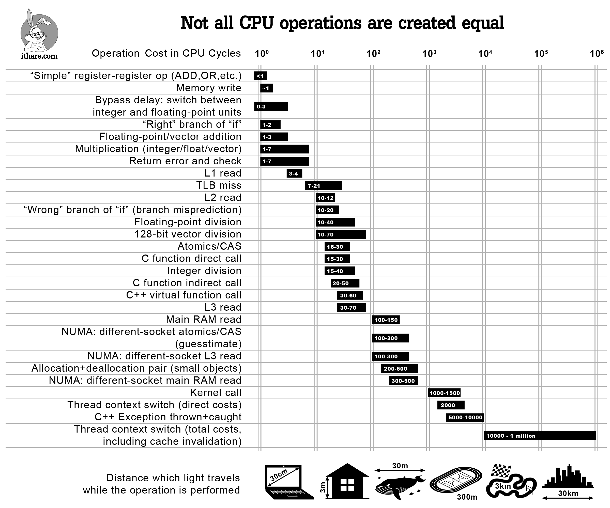

# 1. Базовые сведения о программировании

## 1. Что такое компьютер ?

Современный компьютер можно описать как «машина, которая хранит и манипулирует информацией под контролем заменяемых программ».

В этом определении существует два элемента: 

* компьютер, это устройство, которое манипулирует информацией.

Это означает, что мы помещаем информацию в компьютер, она преобразовывается в новые, полезные формы, а потом выводится на экран или с помощью других устройства вывода.

Компьютер это не единственное устройство, которое манипулирует информацией. Например, простейший калькулятор тоже принимает ввод от пользователя, преобразует информацию \(выполняет вычисления\), после чего выводит на экран результат. Но мы не считаем калькулятор компьютером. Почему? Дело в том что калькулятор \(как и множество других электронных устройств, которые нас окружают\) построен так, чтобы выполнять одну конкретную задачу.

Помимо манипулирования информацией, компьютер должен иметь второе важное свойство:

* компьютер действуют под управлением заменяемых программ.

Что это значит? Компьютерная программа это детальный, пошаговый набор инструкций, который **точно** говорит компьютеру, что делать. Если мы заменим программу, то компьютер будет выполнять набор других действий и будет выполнять другую задачу. Эта гибкость позволяет компьютеру в один момент быть текстовым редактором, в следующий момент записной книжкой, а потом аркадной игрой. Машина остается той же, но программа, которая контролирует машину, меняется.

Каждый компьютер, это машина для выполнения программ. Существует множество «видов» компьютеров \(персональные компьютеры, ноутбуки, планшеты, смартфоны и так далее\). Все эти компьютеры, с помощью соответствующего программного обеспечения, может выполнять все задачи, которые могут выполнять все остальные компьютеры.

## 2. Как устроен компьютер?

Как мы уже поняли, программная часть \(**software**\) управляет физической машиной \(**hardware**\).

Программная часть определяет, что может делать компьютер. Процесс создания компьютерных программ – программирование.

Для того чтобы научиться программировать, не обязательно досконально знать все подробности работы компьютера, но важно знать базовые принципы. Это напоминает вождение автомобиля. Вы можете водить автомобиль без знаний того, что происходит под капотом, но желательно знать хотя бы приблизительно, как работает автомобиль, чтобы лучше водить машину.

Различные компьютеры могут сильно отличаться друг от друга, но в общих деталях, все компьютеры устроены примерно одинаково.

**Центральный процессор \(CPU\)** – это «мозг» компьютера. Он выполняет все базовые операции в компьютере. ЦП выполняет арифметические операции \(сложение двух чисел\), а также логические операции \(сравнение двух чисел\)

Память хранит код программы и данные. Процессор имеет прямой доступ к информации, которая хранится в оперативной памяти \(которая называется RAM или Random Access Memory\). Оперативная память очень быстрая, но она также энергозависима. Если питание будет отключено \(или произойдет перезагрузка компьютера\), информация в ОЗУ будет потеряна.

Вторичная память предоставляет более постоянное хранилище. В современном настольном компьютере, это как правило жесткий диск \(HDD\) или твердотельный накопитель \(SSD\). Также поддерживается отсоединяемое хранилище \(USB-флешки\) или лазерные диски \(CD, DVD\).

Люди взаимодействуют с компьютером через входные \(input\) и выходные \(output\) устройства. Входные устройства: мышка, клавиатура. Выходные: монитор.

Информация поступает из входных устройств и обрабатывается CPU и может перемещаться из\в основную и дополнительную память. Когда информацию необходимо предоставить, CPU отсылает ее на один или несколько выходных устройств.

Так что же происходит, когда вы запускаете свою любимую игрушку или текстовый редактор? Прежде всего, компьютерный код, из которого состоит программа, копируется из вторичной памяти в основную. Как только инструкции загружены, CPU начинает выполнять программу.

Технические, CPU следует циклу **fetch-execute**. Первая инструкция извлекается из основной памяти, декодируется чтобы понять, что это за команда, выполняется соответствующее действие.  Далее, следующая инструкция извлекается, декодируется и выполняется.

Цикл выполняется инструкция за инструкцией. По факту, это все что делает процессор: **fetch,** **decode,** **execute**. Компьютер может выполнять поток этих инструкций с очень быстрой скоростью, выполняя миллиарды инструкций в секунду.

### Хранение данных

В современном мире данные представлены в различной форме: текст, аудио, изображения, видео и так далее.

Компьютерные программы должны иметь возможность обрабатывать разные типы данных:

* программы для инженеров, в основном, используются для работы с числами: выполнение арифметических операций, алгебраических или тригонометрических выражений, нахождение корней дифференциальных уравнений и так далее;
* текстовые редакторы, в основном, работают с текстом: форматирование, перенос, удаление и так далее;
* компьютер также обрабатывает аудио данные. Компьютер может воспроизводить музыку, записывать аудио;
* программы для обработки изображений используют компьютер для работы с изображениями: создание, масштабирование, цветокоррекция и тому подобное.

Все данные в компьютере хранятся в едином формате - в виде набора бит.

#### Bit \(бит\)

Термин **бит** \(**bit**\) используется для представления наименьшего объема информации в компьютере и может принимать значение 0 или 1. Бит моделирует устройство, которое может принимать одно из двух состояний.

Для того, чтобы моделировать различные типы данных, мы используем последовательность бит \(bit pattern\) - комбинацию из 0 и 1. По традиции, 8 бит называются **байтом**.

Возьмем, к примеру, последовательность `0100 0001`. В зависимости от того, какие данные моделирует эта последовательность, это может быть символ текста, просто целое число, часть изображения и так далее.

## 3. Языки программирования

Мы уже знаем, что программа – это просто набор инструкций, который говорит компьютеру что делать. Очевидно, что мы должны предоставить эти инструкции на языке, который компьютер может понять.

Было бы здорово, если бы компьютер понимал человеческую речь, и мы могли бы просто сказать компьютеру, что нужно сделать \(как в научной фантастике\).

Но это пока фантастика и, к тому же, «натуральные» языки тяжело подходят для описания сложных алгоритмов, так как любой «натуральный» язык наполнен неточностями и двусмысленностью.

Для того, чтобы общаться с компьютерами, учеными были придуманы специальные нотации, чтобы можно было точно и недвусмысленно сформулировать набор инструкций для компьютера. Эти нотации называются **языками программирования** 

Каждая запись в языке программирования имеет точную форму \(синтаксис\) и точное значение \(семантику\).

Язык программирования это что-то вроде кода для записи инструкций, которым будет следовать компьютер. Программисты часто говорят о программах как о **компьютерном коде**, а сам процесс записи алгоритма на языке программирования называют **кодированием**.

Однако при использовании языков программирования возникает проблема. Центральный процессор может понимать только **машинный код** – набор команд с аргументами. Машинный код тяжело воспринимается человеком и на нем тяжело написать хоть сколько-нибудь серьезную программу. Такого рода языки называются **языками низкого уровня \(low-level** **language\)**.

Например, вывод надписи «Hello, world!» в поток вывода в машинном коде выглядит следующим образом

**Языки высокого уровня** \(**high-level** **language**, например: C, Python, Java, C++ и другие\) призваны облегчить написание программы за счет того, что язык хорошо понятен для человека и оперирует привычными ему понятиями, а не регистрами, адресами памяти и так далее. К примеру, на языке Python та же программа \(вывод сообщения «Hello, world!»\) выглядит следующим образом:

Но как преобразовать код на языке высокого уровня в набор инструкций на машинном языке?

Существует множество подходов для реализации этого преобразования, рассмотрим два из них.

Первый подход – **компилируемые языки** программирования. **Компилятор** – это сложная компьютерная программа, которая принимает на вход код высокого уровня и преобразует его в эквивалентную программу на машинном языке. Компиляторы пишутся для конкретного языка, для конкретного типа процессора и для конкретной операционной системы.

Программа на языке высокого уровня называется исходным кодом, а в результате получается машинный код, который может напрямую выполнять процессор.

Второе подход – **интерпретируемые языки программирования.** **Интерпретатор** – специальная программа, которая симулирует компьютер, который понимает язык высокого уровня. Вместо того чтобы преобразовывать \(транслировать\) исходный код в эквивалентный машинный код, интерпретатор анализирует и выполняет исходный код инструкция за инструкцией \(то есть, напрямую с процессором работает не ваш код, а интерпретатор\). Интерпретатор еще называют **виртуальной машиной**.

Существует множество плюсов и минусов того или иного подхода, но сразу стоит отметить одно важное отличие – портируемость \(portability\). Компилируемые языки программирования имеют низкую портируемость кода за счет того, что необходимо адаптировать код для тех или иного процессора или для той или иной операционной системы. К тому же, для некоторых конфигурацией может не быть готового компилятора или он может быть неэффективным.

В случае использования интерпретируемых языков, портируемость выше. Разработчики языка, а также сообщество предоставляют интерпретаторы для всевозможных устройств – от микроконтроллеров до полноценных ПК. Вам как разработчиком не надо задумываться о том, где будут запускать ваш код и не предоставлять разные версии приложения для разных конфигураций.

Для разработчика программы на интерпретируемом языке программирования, интерпретатор для определенной конфигурации ПК ничем не отличается от интерпретатора, например, для микрокомпьютера Raspberry Pi. Если для того или иного устройства реализован интерпретатор, вы можете запустить на нем ваш код без проблем.

